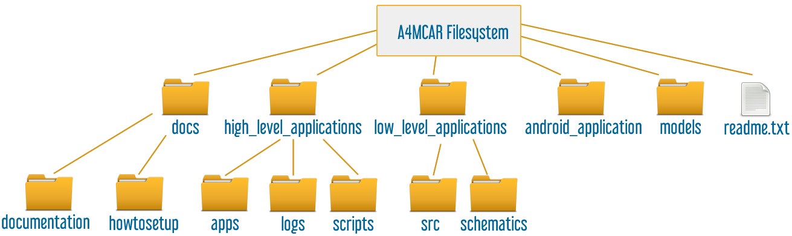

.. toctree::
   :glob:

   
Software Setup
###############

.. _cloneour:

*************************************************
Downloading A4MCAR applications from the Git repo
*************************************************

The A4MCAR's software is distributed in an open-source repository. To clone it to your system please use the following command.

.. note::  Note that in this documentation it is assumed that you download your a4mcar folder to the ``/home/pi`` directory.

.. note::  You should have ``git`` installed. Run ``sudo apt-get install git`` if you don't have it.

.. code-block:: bash
   :linenos:

   git clone https://git.eclipse.org/r/app4mc/org.eclipse.app4mc.examples
   
Then, move a4mcar folder to the ``/home/pi`` directory by running the following:

.. code-block:: bash
   :linenos:

   mv org.eclipse.app4mc.examples/a4mcar/ /home/pi

*********************
Provided Filesystem 
*********************

   A4MCAR Filesystem
   
The repository should have the following main folders:
	
*	**web_interface :**  The web interface that is developed for A4MCAR project which is used to control A4MCAR over remote Wi-Fi connection. In order to set up web_interface, run the setup script: ``web_interface/setup_web_interface.sh``. In order to run the web_interface correctly, the high-level modules core_reader and ethernet_client should be ready and working. To run the ``web_interface`` one should connect to the access point of Raspberry Pi from a client computer web browser and visit ``http://<IP_Address>/jqueryControl2.php`` or ``http://<IP_Address>/jqueryControl.php``.
					
*	**high_level_applications :**  This module consists of several high-level applications that are developed for A4MCAR's high-level module (Raspberry Pi). These applications involve: ``touchscreen_display``, ``core_recorder``, ``dummy_loads``, ``ethernet_client``, and ``image_processing``. n order to run the applications, respective Python files could be run or C/C++ binaries could be executed. Also the scripts that are located under scripts folder could be used to initialize some of the applications. In order to set up high_level_applications module dependencies, one should run the setup script and follow the instructions: ``high_level_applications/setup_high_level_applications.sh``.
									
*	**models:**  A4MCAR's hardware and software model with Eclipse APP4MC is located in this directory.
								
*	**android_application:**  This directory consists of the source files that belong to the A4MCAR's bluetooth based driving application. The source and design files could be used in an Android IDE in order to make tweaks to the application and to generate new .apk files.
								
*	**low_level_applications:**  ``low_level_applications`` module involves the source code for the low-level module that are run using a multi-core microcontroller XMOS xCORE-200 eXplorerKIT. The low level applications are responsible for tasks such as sensor driving, actuation, communication, and core monitoring of the A4MCAR. The low_level_applications module could be imported into xTIMEcomposer to make tweaks to the tasks.
								
*	**docs:**  Involves documentation and Sphinx-generated how-to-setup manual.
	

*******************************
High-Level Applications Setup
*******************************

Raspberry Pi Basic Setup
========================

In order to install the high level applications to the `Raspberry Pi 3 <https://www.raspberrypi.org/products/raspberry-pi-3-model-b/>`_, several preparations should be made. In order to boot a Raspberry Pi 3 with a Raspbian Jessie distribution, one should use the `Raspbian Jessie Download Link <https://downloads.raspberrypi.org/raspbian_latest>`_.

After the Raspbian image is downloaded, a disk imager software could be used to burn the image to an SD card. To do that you can follow the instructions given in `this link <https://www.raspberrypi.org/documentation/installation/installing-images/windows.md>`_.

Access Point Setup
==================

For the convenient development, Raspberry Pi 3 should be set up as an access point. The access point helps regarding connecting to the Raspberry Pi's shell via SSH for entering Linux commands.

To set up the access point, the guidelines given in `PolarSys Rover Raspberry Pi Configuration Doc Step 1.4 <https://github.com/gaelblondelle/PSysRoverInitialContrib/blob/master/documentation/c_getting_started/org.polarsys.rover.c.getting_started/raspberry_pi_configuration.asciidoc#step-14---network-connections>`_ can be followed.

.. _overallsetup:

Installation of A4MCAR's high-level application and its dependencies
====================================================================

Automatic Setup and Installation
--------------------------------

Provided applications involve a setup script that can be used to install required dependencies manually. To execute the script, run:

.. code-block:: bash
   :linenos:

   sudo bash /home/pi/a4mcar/high_level_applications/setup_high_level_applications.sh

Manual Setup and Installation
------------------------------

Installation of Some Useful Applications
^^^^^^^^^^^^^^^^^^^^^^^^^^^^^^^^^^^^^^^^

.. note:: This part is created for instructive purposes. The setup shown here is carried out automatically with :ref:`overallsetup`.

A4MCAR requires some third party software during both development and application execution. These applications could be listed as follows:

* ``git`` is a tool that is used for cloning repositories to your computer.

* ``python-pip`` is a package that is used for installing python modules.

* ``cmake`` is a very easy-to-use tool that generates Makefiles very conveniently.

* ``build-essential`` package helps regarding compiling applications using GNU/Linux systems.

* ``python-prctl`` package is used in A4MCAR for registering thread names with Python.

* Also, python development modules and resources should be installed: ``python-dev``, ``python3-dev``, ``python-pkg-resources``, ``python3-pkg-resources``.

You should install them using:

.. code-block:: bash
   :linenos:

   sudo apt-get update
   sudo apt-get install python-dev python3-dev python-pkg-resources python3-pkg-resources 
   sudo apt-get install git build-essential python-prctl python-pip cmake

   
Cloning Necessary Modules
^^^^^^^^^^^^^^^^^^^^^^^^^^
   
.. note:: This part is created for instructive purposes. The setup shown here is carried out automatically with :ref:`overallsetup`.

A repository is present for providing necessary dependencies for the A4MCAR project's high-level applications. This repository should be cloned and installations should be carried out using this documentation.

To clone the repository,

.. code-block:: bash
   :linenos:

   cd ~/Downloads
   sudo git clone https://gitlab.pimes.fh-dortmund.de/RPublic/a4mcar_required_modules.git

Using virtkey
^^^^^^^^^^^^^^

.. note:: This part is created for instructive purposes. The setup shown here is carried out automatically with :ref:`overallsetup`.

After cloning necessary modules, you should execute the following command to move the virtkey module to where it is used.

.. code-block:: bash
   :linenos:

   sudo cp -r ~/Downloads/a4mcar_required_modules/high_level_applications/virtkeyboard/* /home/$USER/a4mcar/high_level_applications/apps/touchscreen_display/

Camera and Streaming Setup
^^^^^^^^^^^^^^^^^^^^^^^^^^^^

.. note:: This part is created for instructive purposes. The setup shown here is carried out automatically with :ref:`overallsetup`.

In order to set-up the Raspberry Pi camera and the streaming application ``mjpg-streamer``, following steps should be followed:

First, you need to enable the Raspberry Pi camera from the OS. To do that, type

.. code-block:: bash
   :linenos:

   sudo raspi-config
   
A configuration screen should appear. Here, select ``Advanced`` >> ``Enable Camera`` and then save and exit from the screen.

To stream using Raspberry Pi camera, an experimental third-party streamer module ``mjpg-streamer-experimental`` is used. 

First, start by installing the dependencies and carrying out other necessary steps:

.. code-block:: bash
   :linenos:

   sudo apt-get install libjpeg8-dev imagemagick libv4l-dev
   sudo ln -s /usr/include/linux/videodev2.h /usr/include/videodev.helps
   
Now, we should install the ``mjpg-streamer-experimental``:

Installing psutil from Python for Core Monitoring
^^^^^^^^^^^^^^^^^^^^^^^^^^^^^^^^^^^^^^^^^^^^^^^^^^

.. note:: This part is created for instructive purposes. The setup shown here is carried out automatically with :ref:`overallsetup`.

.. warning:: Here we use pip version 1.5.6 to install.

You can use the following commands to install the ``psutil`` package from our repository:

.. code-block:: bash
   :linenos:
   
   sudo easy_install pip==1.5.6
   sudo pip install ~/Downloads/a4mcar_required_modules/high_level_applications/psutil/

Apache Web Server Installation
^^^^^^^^^^^^^^^^^^^^^^^^^^^^^^^^

.. note:: This part is created for instructive purposes. The setup shown here is carried out automatically with :ref:`overallsetup`.

In order to install Apache Web Server on your system to be able to use front-end web interface functionality of A4MCAR, you can follow the guidelines provided in this section.

First, you should upgrade your system's repository list and your upgrade your system via:

.. code-block:: bash
   :linenos:

   sudo apt-get update
   sudo apt-get upgrade

Then type the following commands to install apache2 server, php mods for the server, and easy Makefile tool cmake:

.. code-block:: bash
   :linenos:

   sudo apt-get install apache2 -y
   sudo apt-get install php5 libapache2-mod-php5 -y
   sudo apt-get install cmake

After these steps, the website should appear at the ``/var/www/html`` directory. Now, we are off to grant some permissions to our Raspberry Pi's user groups for this directory. Security is not a main concern in our application, so please use them at your own risk:

.. code-block:: bash
   :linenos:
      
   sudo chgrp -R www-data /var/www/html/
   sudo find /var/www/html/ -type d -exec chmod g+rx {} +
   sudo find /var/www/html/ -type f -exec chmod g+r {} +

The following gives permissions to your specific user. If you use username other than ``pi``, make sure to adjust it in the following commands:

.. code-block:: bash
   :linenos:

   sudo chown -R pi /var/www/html/
   sudo find /var/www/html/ -type d -exec chmod u+rwx {} +
   sudo find /var/www/html/ -type f -exec chmod u+rw {} +

Subsequently, you should enable access to Linux file-system via webpages by using:

.. code-block:: bash
   :linenos:

   sudo visudo

and then, use your favourite editor to add the following to the end, save and exit.

.. code-block:: bash
   :linenos:

   www-data ALL=(ALL) NOPASSWD: ALL

Now you can place our web interface to the ``/var/www/html/`` directory and start visualizing the interface from ``http://<Your_IP_Address>/jQueryControl.php`` or ``http://<Your_IP_Address>/jQueryControl2.php``

Installing OpenCV 3.0
^^^^^^^^^^^^^^^^^^^^^^

OpenCV should be installed for Image Processing application to work. In A4MCAR, C++ development library for OpenCV is used. The application is built and linked using GNU Make / CMake.

For OpenCV 3.0 C++ download and installation, please refer to `OpenCV 3.0 Install <http://docs.opencv.org/3.0-beta/doc/tutorials/introduction/linux_install/linux_install.html#linux-installation>`_.

Installing Raspicam
^^^^^^^^^^^^^^^^^^^^^^

To install raspicam-0.1.3, please refer to `raspicam-0.1.3 Install <https://github.com/6by9/raspicam-0.1.3>`_.
